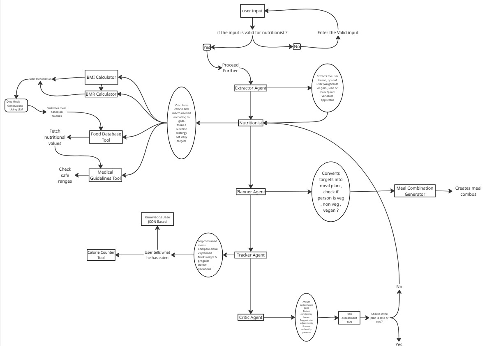

# 🥗 NutritionAI: Multi-Agent Health Orchestrator

[](https://www.python.org/downloads/)
[](https://github.com/langchain-ai/langgraph)
[](https://modelcontextprotocol.io/)

**NutritionAI** is a sophisticated, multi-agent system built on **LangGraph** and **Gemini**. Unlike traditional chatbots, this system utilizes **Agentic Reasoning**, **Reflection Loops**, and a **Model Context Protocol (MCP)** server to provide medically validated, persistent, and personalized nutrition management.

---

## 🏗️ System Architecture

The core of NutritionAI is a directed graph that manages state transitions between specialized nodes. This ensures that every recommendation is grounded in real data and safety-checked.




### **The Multi-Agent Team**
* **🧠 Planner Agent:** Deconstructs high-level user goals into actionable dietary requirements.
* **🍳 Nutritionist Agent:** Executes complex calculations and interfaces with the **USDA API** for real-world nutritional grounding.
* **⚖️ Critic Agent:** A safety guardrail that validates macros. It can trigger a **Reflection Loop** to force the Planner to iterate if a plan is unsafe.
* **📈 Tracker Agent:** Handles persistent state, logging daily progress and weight entries into **PostgreSQL**.
* **📚 KB Responder:** A RAG-based node for answering general health queries using a curated knowledge base.

---

## 🔄 Graph Flow & Logic

The orchestrator follows a precise execution pipeline to ensure data integrity:

1.  **Extraction:** LLM extracts name, intent, and physical stats from raw natural language using **Pydantic** for strict schema validation.
2.  **Persistence Check:** The `check_history` node verifies the user against **PostgreSQL**.
3.  **Context Loading:** Historical data (height, weight, past preferences) is hydrated into the current state.
4.  **Planning & Validation:** The Nutritionist generates a plan, which is audited by the **Medical Critic**.
5.  **Persistence:** Finalized plans and new metrics are committed back to the database.


---

## 🛠️ Technical Stack

* **Orchestration:** LangGraph (Deterministic State Machine)
* **LLM:** Google Gemini 3 Flash / Llama 3.1 (via Groq)
* **Tool Protocol:** Model Context Protocol (MCP)
* **Database:** PostgreSQL (User Stats & Structured History)
* **Memory Layer:** Hybrid (Relational DB + Vector RAG for habit tracking)
* **Schema Validation:** Pydantic (Strict JSON Extraction)

---

## 🚀 Getting Started

### 1. Prerequisites
* Python 3.10+
* PostgreSQL Server (running on port 5432 or 5433)
* Environment variables set in `.env` (DB_NAME, DB_USER, DB_PASS, GROQ_API_KEY)

### 2. Running the System
The system requires two components to be active:

**Step 1: Start the MCP Server**
```bash
cd app/mcp_server
python server.py